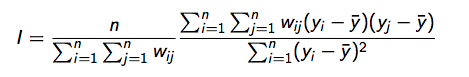

```{r setup, include=FALSE}
knitr::opts_chunk$set(echo = TRUE)
```


## Tobler’s first law of geography 
_“Everything is related to everything else, but near things are more related than distant things”._

Often we can use autocorrelation as prediction (ie. interpolation [next week]). 

* But it is also an important component of mechanistic modeling. 
* Can ecology beat the null model of autocorrelation?

### References 
* http://rspatial.org/analysis/rst/3-spauto.html
* http://www.bias-project.org.uk/ASDARcourse/unit6_slides.pdf
* http://www.stat.purdue.edu/~bacraig/SCS/Spatial%20Correlation%20new.doc
* https://dynamicecology.wordpress.com/2013/10/02/autocorrelation-friend-or-foe/comment-page-1/

### What is autocorrelation? 
__Autocorrelation__ refers to the correlation of a time series with its own past and future values

```{r,message=F,warning=F,fig.width=7,fig.height=4}
library(dplyr)
par(mar=c(3,3,1,1),mgp=c(1.5,0.5,0))

met = read.csv('Data/arbMet.csv',stringsAsFactors = F)
met = met %>% mutate(DATE = as.Date(DATE))
met$tmax = approx(met$DATE,met$TMAX, xout = met$DATE, method="linear")[[2]] # Fill in gaps linearly 
met[is.na(met$PRCP),]$PRCP = 0 # replace NA precip events with zero 

plot(met$DATE,met$TMAX,type='l',ylab='Max Temperature', xlab = 'Date')
acf(met$tmax,lag.max = 100) # auto-correlation function
acf(met$PRCP,lag.max = 100)
``` 

__Spatial autocorrelation__ measures the correlation of a variable with itself through space. 

* Spatial autocorrelation can be positive or negative. 
* Positive spatial autocorrelation occurs when similar values occur near one another. 
* Negative spatial autocorrelation occurs when dissimilar values occur near one another.

 
https://docs.aurin.org.au/wp-content/uploads/sites/2/2014/09/Spatial_Autocorrelation.jpg

### Why should we care about autocorrelation? 
* Autocorrelation invalidates most traditional statistical inference tests
* If SA exists, then the results of standard statistical inference tests  may be incorrect
    * Correlation coefficients appear to be bigger than they really are
    * They are more likely to be found “statistically significant” (p-value inflation)
* Must use spatial statistical inference tests               


## How do we detect spatial autocorrelation? 
Basically turning autocorrelation (repeated correlations) to two dimensions. 

To accomplish this, a __spatial weights matrix__ is computed. 

### Spatial Matrix ###
* `spdep` package
* The first step is to determine the sets of neighbours for each
observation, the second to assign weights to each neighbour
relationship

### Weight Matrix ###
To assess spatial autocorrelation

1) What is meant by two observations being close together
    * i.e., a distance measure must be determined. 
2) These distances are presented in weight matrix, which defines the relationships between locations where measurements were made.  

The weight matrix can be specified in many ways:
* The weight for any two different locations is a constant.
* All observations within a specified distance have a fixed weight.
* K nearest neighbors have a fixed weight, and all others are zero.
* Weight is proportional to inverse distance, inverse distance squared, or inverse distance up to a specified distance.

Other weight matrices are possible.  The weight matrix is often row-standardized, i.e., all the weights in a row sum to one.  Note that the actual values in the weight matrix are up to the researcher.


### Moran’s I 
Moran's I measures spatial autocorrelation based on both feature locations and feature values simultaneously. 
Given a set of features and an associated attribute, it evaluates whether the pattern expressed is clustered, dispersed, or random. 

Moran’s I is calculated as a ratio of the product of the variable of
interest and its spatial lag, with the cross-product of the variable of
interest, and adjusted for the spatial weights used:

 

where `yi` is the i-th observation, `¯y` is the mean of the variable of
interest, and `wij` is the spatial weight of the link between `i` and `j`.

Centering on the mean is equivalent to asserting that the correct
model has a constant mean, and that any remaining patterning
after centering is caused by the spatial relationships encoded in the
spatial weights

## Compute spatial autocorrelation examples: Percent water in Wisconsin counties
```{r,message=F,warning=F,fig.width=7,fig.height=4}
# Load data
perWater = read.csv('../Zoo955_WeeklyAssignments/Week6_WIwater_NLCD.csv',stringsAsFactors = F)
# Counties data 
library(rgdal)
counties = readOGR('../Lecture6_Overlays/Data/County_Boundaries_24K/County_Boundaries_24K.shp',layer='County_Boundaries_24K')
# Add water to dataframe
counties$water = perWater$perWater
```

```{r,message=F,warning=F,fig.width=7,fig.height=5}
# Because we're going to keep plotting counties, simplify data
library(rgeos)
cSimp <- gSimplify(counties, tol=5000, topologyPreserve=TRUE)
plot(cSimp)
# Get centroid coordinates and plot
xy <- coordinates(counties)
points(xy, cex=2, pch=20)
```

### Find adjacent polygons
* Neighbors will typically be created from a spatial polygon file. 
* Neighbors can be based on contiguity, distance, or the k nearest neighbors may be defined (other options as well).
* To find adjacent polygons, use package `spdep`

#### Adjacent polygons 
```{r,message=F,warning=F,fig.width=7,fig.height=5}
library(spdep)
# Construct neighbours list from polygon list
w <- poly2nb(counties, row.names= counties$OBJECTID)
class(w)
summary(w)

# Plot the links between the polygons
plot(cSimp, main='Adjacent polygons')
plot(w, xy, col='red4', add=TRUE, lwd=2)
```

#### k-nearest neighbors 
```{r,message=F,warning=F,fig.width=7,fig.height=5}
par(mfrow=c(1,2),mar=c(0,0,2,0))
# 4 neighbors
k = knearneigh(xy, k = 3)
k4 = knn2nb(k, row.names = counties$OBJECTID)
plot(cSimp, main='k nearest neighbors = 4')
plot(k4, xy, col='red4', add=TRUE, lwd=2)

# 2 neighbors
k = knearneigh(xy, k = 2)
k2 = knn2nb(k, row.names = counties$OBJECTID)
plot(cSimp, main='k nearest neighbors = 2')
plot(k2, xy, col='red4', add=TRUE, lwd=2)
```

#### Distance matrix 
```{r,message=F,warning=F,fig.width=7,fig.height=5}
par(mfrow=c(1,2),mar=c(0,0,2,0))
# Distance = 50 km
d50 =  dnearneigh(xy, d1 = 0, d2 = 50000, row.names = counties$OBJECTID)
plot(cSimp, main='neighbors, distance = 50km')
plot(d50, xy, col='red4', add=TRUE, lwd=2)

# Distance = 100 km
d100 =  dnearneigh(xy, d1 = 0, d2 = 100000, row.names = counties$OBJECTID)
plot(cSimp, main='neighbors, distance = 100km')
plot(d100, xy, col='red4', add=TRUE, lwd=2)
```

### Transform w into a spatial weights matrix. 
A spatial weights matrix reflects the intensity of the geographic relationship between observations

```{r,message=F,warning=F,fig.width=7,fig.height=5}
wm.w <- nb2mat(w, style='B')
wm.w[1:10,1:10]
```


### Compute Moran's I
To do this we need to create a ‘listw’ type spatial weights object (instead of the matrix we used above) 
To get the same value as above we use “style=’B’” to use binary (TRUE/FALSE) distance weights.
```{r,message=F,warning=F,fig.width=7,fig.height=5}
wm.w <-  nb2listw(w, style='B')
wm.w

wm.k4 <- nb2listw(k4, style='B')
wm.k2 <- nb2listw(k2, style='B')

wm.d50 <- nb2listw(d50, style='B',zero.policy = T)
wm.d100 <- nb2listw(d100, style='B',zero.policy = T)
```

#### Now we can use the moran function.

* x	 = a numeric vector the same length as the neighbours list in listw
* listw	= a listw object created for example by nb2listw
* n	= number of zones
* S0	= global sum of weights
```{r,message=F,warning=F,results=F,fig.width=7,fig.height=5}
moran(x = counties$water,listw = wm.w, n=length(wm.w$neighbours), S0=Szero(wm.w))
moran(x = counties$water,listw = wm.k4, n=length(wm.k4$neighbours), S0=Szero(wm.k4))
moran(x = counties$water,listw = wm.k2, n=length(wm.k2$neighbours), S0=Szero(wm.k2))
moran(x = counties$water,listw = wm.d50, n=length(wm.d50$neighbours), S0=Szero(wm.d50),zero.policy = T)
moran(x = counties$water,listw = wm.d100, n=length(wm.d100$neighbours), S0=Szero(wm.d100),zero.policy = T)
```

-----------------------------
Weight Matrix      Morans I  
------------------ ---------- 
Adjacent            0.16

K-nearest = 4       0.30

K-nearest = 2       0.48

Distance = 50km     0.27

Distance = 100km    0.003
-----------------------------

The math behind the Global Moran's I statistic is shown above 

* Computes the mean and variance for the attribute being evaluated. 
* For each value, it subtracts the mean, creating a deviation from the mean. 
* Deviation values for all neighboring features (created via methods above) are multiplied together to create a cross-product. 
    * When values for neighboring features are either both larger than the mean or both smaller than the mean, the cross-product will be positive.
    * If the values in the dataset tend to cluster spatially (high values cluster near other high values; low values cluster near other low values), the Moran's Index will be positive. 
    
* The more neighbors an area has, the higher likelihood the cross-product will be close to zero

#### Test for significance 
First analytically, using linear regression based logic and assumptions.
```{r,message=F,warning=F,results=F,fig.width=7,fig.height=5}
moran.test(counties$water, wm.w, randomisation=FALSE)
```
__p-value = 0.00733__

#### But should probably use Monte Carlo simulation instead.
Values are randomly assigned to the polygons, and the Moran’s I is computed.
This is repeated several times to establish a distribution of expected values.
The observed value of Moran’s I is then compared with the simulated distribution to see how likely
it is that the observed values could be considered a random draw.

```{r,message=F,warning=F,results=F,fig.width=7,fig.height=5}
moran.mc(counties$water, wm.w, nsim=99)
```
__p-value = 0.01__

```{r,message=F,warning=F,results=F,fig.width=7,fig.height=5}
moran.test(counties$water, wm.w, randomisation=FALSE)
moran.test(counties$water, wm.k4, randomisation=FALSE)
moran.test(counties$water, wm.k2, randomisation=FALSE)
moran.test(counties$water, wm.d50, randomisation=FALSE,zero.policy = T)
moran.test(counties$water, wm.d100, randomisation=FALSE)

moran.mc(counties$water, wm.w, nsim=999)
moran.mc(counties$water, wm.k4, nsim=999)
moran.mc(counties$water, wm.k2, nsim=999)
moran.mc(counties$water, wm.d50, nsim=999,zero.policy = T)
moran.mc(counties$water, wm.d100, nsim=999)
```
-------------------------------------------------------
Weight Matrix      Morans I   p-Value (LR) p-Value (MC)
------------------ ---------- ------------ ------------
Adjacent            0.16       0.00733       0.018

K-nearest = 4       0.30       0.0001883     0.003

K-nearest = 2       0.48       2.405e-06     0.001

Distance = 50km     0.27       0.002334      0.009

Distance = 100km    0.003      0.3517        0.311
------------------------------------------------------

Null hypothesis = attribute being analyzed is randomly distributed among the features in your study area

### Discussion 
How would you expect the spatial autocorrelation of %water to change as you decreased or increased the resolution 
of the underlying raster data? 

### Homework

1) Find an example of negative spatial autocorrelation in ecology
2) Use the county and NLCD datasets for WI. Compute Moran's I and p-value (using adjacent polygons) for:
    * Percent developed
    * Percent forest
