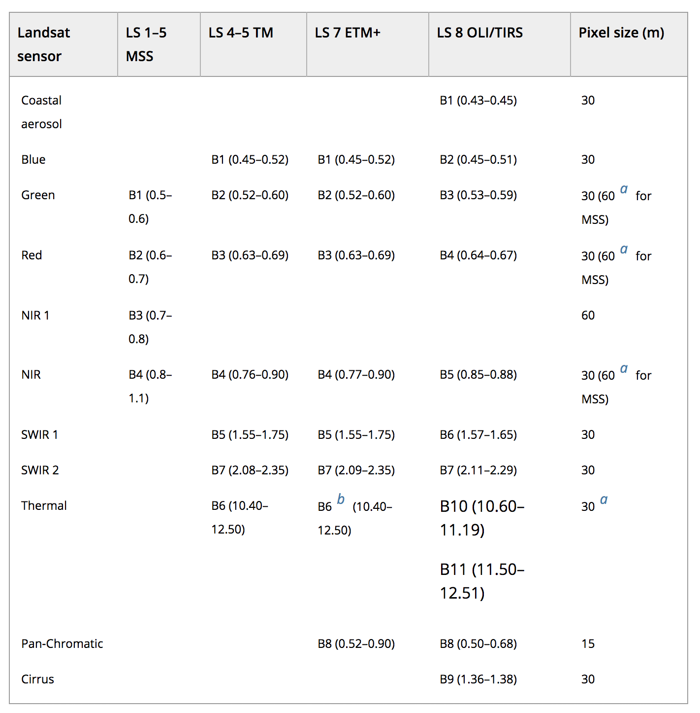

```{r setup, include=FALSE}
knitr::opts_chunk$set(echo = TRUE)
```

### LANDSAT 
Freely available: https://earthexplorer.usgs.gov/

Different bands


## Load imagery and create raster brick 
``` {r, eval = F}
library(raster)
library(sp)

l.blue <- raster('LC08_L1TP_024030_20170602_20170615_01_T1/LC08_L1TP_024030_20170602_20170615_01_T1_B2.TIF')
l.green <- raster('LC08_L1TP_024030_20170602_20170615_01_T1/LC08_L1TP_024030_20170602_20170615_01_T1_B3.TIF')
l.red <- raster('LC08_L1TP_024030_20170602_20170615_01_T1/LC08_L1TP_024030_20170602_20170615_01_T1_B4.TIF')
l.nir <- raster('LC08_L1TP_024030_20170602_20170615_01_T1/LC08_L1TP_024030_20170602_20170615_01_T1_B5.TIF')
l.swir1 <- raster('LC08_L1TP_024030_20170602_20170615_01_T1/LC08_L1TP_024030_20170602_20170615_01_T1_B6.TIF')
l.swir2 <- raster('LC08_L1TP_024030_20170602_20170615_01_T1/LC08_L1TP_024030_20170602_20170615_01_T1_B7.TIF')
l.pc <- raster('LC08_L1TP_024030_20170602_20170615_01_T1/LC08_L1TP_024030_20170602_20170615_01_T1_B8.TIF')
l.cirrus <- raster('LC08_L1TP_024030_20170602_20170615_01_T1/LC08_L1TP_024030_20170602_20170615_01_T1_B9.TIF')
l.t1 <- raster('LC08_L1TP_024030_20170602_20170615_01_T1/LC08_L1TP_024030_20170602_20170615_01_T1_B10.TIF')
l.t2 <- raster('LC08_L1TP_024030_20170602_20170615_01_T1/LC08_L1TP_024030_20170602_20170615_01_T1_B11.TIF')

# Create raster brick
ls = brick(l.red,l.green,l.blue,l.nir,l.swir1,l.swir2,l.cirrus,l.t1,l.t2)

# CROP
e <- extent(280000, 330000, 4750000, 4800000)
ls.c = crop(ls,e)

names(ls.c) <- c('red','green','blue','NIR','SWIR1','SWIR2','cirrus','thermal1','thermal2')
writeRaster(ls.c,filename = 'Madison_Landsat_20170602.tif', format="GTiff", overwrite=TRUE)
```

## Load cropped imagery 
```{r}
library(raster)
library(sp)
r1 = brick('Madison_Landsat_20170602.tif')
r2 = brick('Madison_Landsat_20180317.tif')
names(r1) <- c('red','green','blue','NIR','SWIR1','SWIR2','cirrus','thermal1','thermal2')
names(r2) <- c('red','green','blue','NIR','SWIR1','SWIR2','cirrus','thermal1','thermal2')
```

## R Markdown

This is an R Markdown document. Markdown is a simple formatting syntax for authoring HTML, PDF, and MS Word documents. For more details on using R Markdown see <http://rmarkdown.rstudio.com>.

When you click the **Knit** button a document will be generated that includes both content as well as the output of any embedded R code chunks within the document. You can embed an R code chunk like this:

```{r cars}
summary(cars)
```

## Including Plots

You can also embed plots, for example:

```{r pressure, echo=FALSE}
plot(pressure)
```

Note that the `echo = FALSE` parameter was added to the code chunk to prevent printing of the R code that generated the plot.
