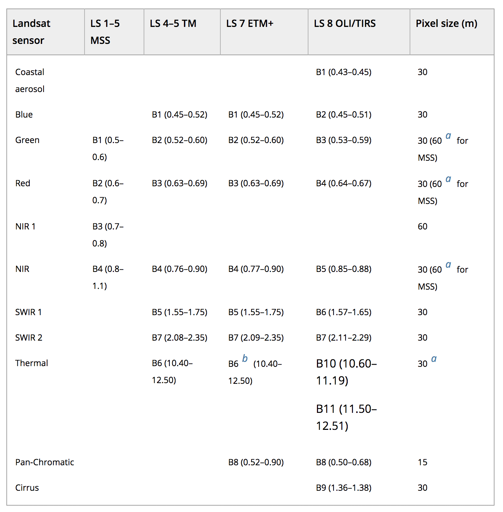

```{r setup, include=FALSE}
knitr::opts_chunk$set(echo = TRUE)
```

### LANDSAT 
Freely available: https://earthexplorer.usgs.gov/

### Sentinel
https://scihub.copernicus.eu/dhus/#/home


### LANDSAT Bands


## Load imagery and create raster brick 
``` {r, eval = F}
library(raster)
library(sp)

l.blue <- raster('LC08_L1TP_024030_20170602_20170615_01_T1/LC08_L1TP_024030_20170602_20170615_01_T1_B2.TIF')
l.green <- raster('LC08_L1TP_024030_20170602_20170615_01_T1/LC08_L1TP_024030_20170602_20170615_01_T1_B3.TIF')
l.red <- raster('LC08_L1TP_024030_20170602_20170615_01_T1/LC08_L1TP_024030_20170602_20170615_01_T1_B4.TIF')
l.nir <- raster('LC08_L1TP_024030_20170602_20170615_01_T1/LC08_L1TP_024030_20170602_20170615_01_T1_B5.TIF')
l.swir1 <- raster('LC08_L1TP_024030_20170602_20170615_01_T1/LC08_L1TP_024030_20170602_20170615_01_T1_B6.TIF')
l.swir2 <- raster('LC08_L1TP_024030_20170602_20170615_01_T1/LC08_L1TP_024030_20170602_20170615_01_T1_B7.TIF')
l.pc <- raster('LC08_L1TP_024030_20170602_20170615_01_T1/LC08_L1TP_024030_20170602_20170615_01_T1_B8.TIF')
l.cirrus <- raster('LC08_L1TP_024030_20170602_20170615_01_T1/LC08_L1TP_024030_20170602_20170615_01_T1_B9.TIF')
l.t1 <- raster('LC08_L1TP_024030_20170602_20170615_01_T1/LC08_L1TP_024030_20170602_20170615_01_T1_B10.TIF')
l.t2 <- raster('LC08_L1TP_024030_20170602_20170615_01_T1/LC08_L1TP_024030_20170602_20170615_01_T1_B11.TIF')

# Create raster brick
ls = brick(l.red,l.green,l.blue,l.nir,l.swir1,l.swir2,l.cirrus,l.t1,l.t2)

# CROP
e <- extent(280000, 330000, 4750000, 4800000)
ls.c = crop(ls,e)

names(ls.c) <- c('red','green','blue','NIR','SWIR1','SWIR2','cirrus','thermal1','thermal2')
writeRaster(ls.c,filename = 'Madison_Landsat_20170602.tif', format="GTiff", overwrite=TRUE)
```

## Load cropped imagery 
```{r}
library(raster)
library(sp)
r1 = brick('Madison_Landsat_20170602.tif')
r2 = brick('Madison_Landsat_20180317.tif')
names(r1) <- c('red','green','blue','NIR','SWIR1','SWIR2','cirrus','thermal1','thermal2')
names(r2) <- c('red','green','blue','NIR','SWIR1','SWIR2','cirrus','thermal1','thermal2')

r1
```

## Plot imagery
```{r}
plot(r2)
```

## Plot RGB
- Can plot indivudal layers of a multi-spectral image, but they are often combined
- To combine three bands, use plotRGB
- Select bands that render in the red, green and blue regions
- Additional arguments to plotRGB to improve the visualization (e.g. a linear stretch of the values, using strecth = "lin").

```{r}
plotRGB(r1, r = 1, g = 2, b = 3, axes = TRUE, stretch = "lin",
        main = "Landsat True Color Composite")
plotRGB(r2, r = 1, g = 2, b = 3, axes = TRUE, stretch = "lin",
        main = "Landsat True Color Composite")

```


## Extract values
```{r}
# Load Lake shapefile
library(sf)
mendota <- st_read('../Lecture2_CRS/Data/LakeMendota.shp') %>%
  st_transform('+proj=utm +zone=16 +datum=WGS84 +units=m +no_defs +ellps=WGS84 +towgs84=0,0,0')
# random sample of 100 points
l.pts <- st_sample(mendota, size = 100) %>% st_sf
lake.s <- extract(r1, as(l.pts,'Spatial')) #summer values
lake.w <- extract(r2, as(l.pts,'Spatial')) #winter values

# Load watershed shapefile
watershed <- st_read('../Lecture3_Shapefiles/Data/YaharaBasins/Mendota_Basin.shp') %>%
  st_transform('+proj=utm +zone=16 +datum=WGS84 +units=m +no_defs +ellps=WGS84 +towgs84=0,0,0')
# random sample of 100 points
ws.pts <- st_sample(watershed, size = 100) %>% st_sf
ws.s <- extract(r1, as(ws.pts,'Spatial'))
ws.w <- extract(r2, as(ws.pts,'Spatial'))

# To see some of the reflectance values
lake.S <- colMeans(lake.s)
lake.W <- colMeans(lake.w)
ws.S <- colMeans(ws.s,na.rm = T)
ws.W <- colMeans(ws.w,na.rm = T)

plot(ws.S,xlab='Bands',ylab='Reflectance',type='b',xaxt='n')
axis(1,at = 1:9,labels = names(r2),las=2)

lines(lake.S,type='b',col='blue')
lines(ws.W,type='b',col='black',pch=16)
lines(lake.W,type='b',col='blue',pch=16)
legend('topleft',legend = c('Watershed - Summer','Lake - Summer','Watershed - Winter','Lake - Winter'),col = c('black','blue','black','blue'),
       pch=c(21,21,16,16),bty='n')
```

### Indices

## Normalized Difference Vegetation Index - NDVI 
Vegetation strongly reflects near-infrared. Plot NIR band as red

```{r}
plotRGB(r1, r = 4, g = 2, b = 3, axes = TRUE, stretch = "lin", main = "NIR Color Composite")
plotRGB(r2, r = 4, g = 2, b = 3, axes = TRUE, stretch = "lin", main = "NIR Color Composite")
```

- Normalized Difference Vegetation Index (NDVI) quantifies vegetation by measuring the difference between near-infrared (which vegetation strongly reflects) and red light (which vegetation absorbs)
- Satellite sensors like Landsat and Sentinel-2 both have the necessary bands with NIR and red

NDVI = (NIR - Red) / (NIR + Red)

```{r}
ndvi1 <- (r1[[4]] - r1[[1]]) / (r1[[4]] + r1[[1]])
ndvi2 <- (r2[[4]] - r2[[1]]) / (r2[[4]] + r2[[1]])

plot(ndvi1, main = 'NDVI June')
plot(ndvi2, main = 'NDVI March')
```
Areas of barren rock, sand, or snow usually show very low NDVI values (for example, 0.1 or less). Sparse vegetation such as shrubs and grasslands or senescing crops may result in moderate NDVI values (approximately 0.2 to 0.5). High NDVI values (approximately 0.6 to 0.9) correspond to dense vegetation such as that found in temperate and tropical forests or crops at their peak growth stage. 

As expected the NDVI is higher during the summer

## Normalized Difference Water Index - NDWI 
Normalized Difference Water Index (NDWI), as described by McFeeters (1996), to differentiate water from non-water

NDWI <- (NIR - GREEN)) / (NIR + GREEN)
```{r}
ndwi1 <- (r1[[2]] - r1[[4]]) / (r1[[4]] + r1[[2]])
ndwi2 <- (r2[[2]] - r2[[4]]) / (r2[[4]] + r2[[2]])

plot(ndwi1, main = 'NDWI June')
plot(ndwi2, main = 'NDWI March')
```

## Normalized Difference Snow Index - NDWI 
Normalized Difference Water Index (NDSI), to differentiate snow/ice

NDSI <- (GREEN - SWIR)) / (SWIR + GREEN)
```{r}
ndsi1 <- (r1[[2]] - r1[[5]]) / (r1[[5]] + r1[[2]])
ndsi2 <- (r2[[2]] - r2[[5]]) / (r2[[5]] + r2[[2]])

plot(ndsi1, main = 'NDSI June')
plot(ndsi2, main = 'NDSI March')
```

### Thresholding
Get an estimate of spatial extent of different features

NDVI: Pixels having NDVI values greater than 0.4 are definitely vegetation. Following operation masks all non-vegetation pixels.
```{r}
par(mfrow=c(1,2))
ndvi1[ndvi1 < 0.4] = NA
plot(ndvi1, main = 'NDVI June')
ndvi2[ndvi2 < 0.4] = NA
plot(ndvi2, main = 'NDVI March')
```

NDWI: Pixels having NDVI values greater than 0.2 may be water. 
```{r}
par(mfrow=c(1,2))
ndwi1[ndwi1 < 0] = NA
plot(ndwi1, main = 'NDWI June')
ndwi2[ndwi2 < 0] = NA
plot(ndwi2, main = 'NDWI March')
```