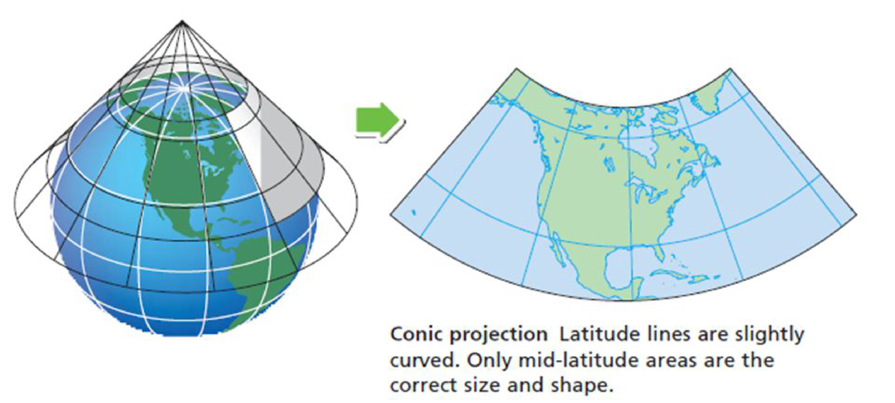
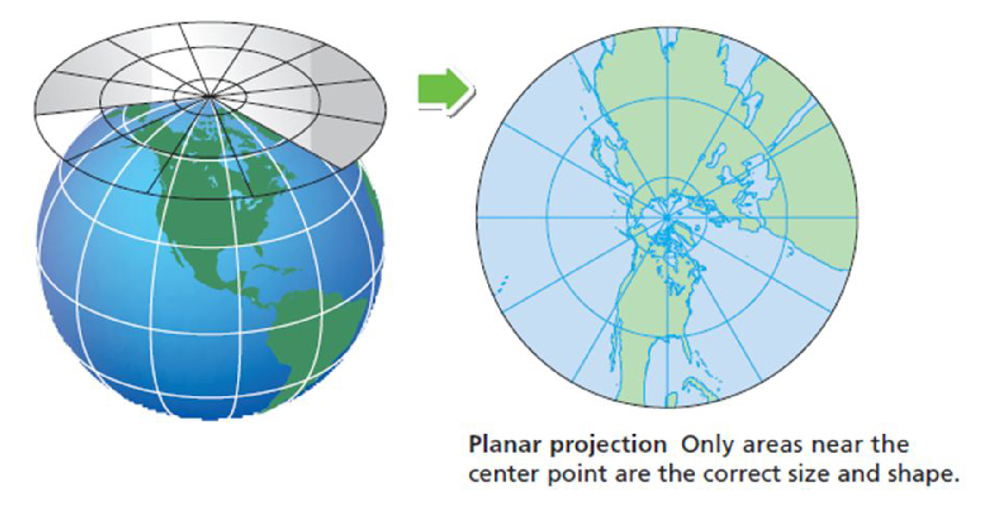

```{r setup, include=FALSE}
knitr::opts_chunk$set(echo = TRUE,fig.width = 7)
```

<!-- ## Why maps are wrong -->
<!-- VOX video --> (https://youtu.be/kIID5FDi2JQ?t=38s) -->

<!-- - Surface of the Earth cannot be represented as a plane without distortion -->
<!-- - Projections are just algorithms to move from sphere to plane -->
<!-- - Maps are data visualization at its best -->

## Maps package
```{r,echo=F}
library(maps)
```
```{r,eval=F}
install.packages('maps')
library(maps)
```

<!-- ``` -->
<!-- map(database = "world", -->
<!--   regions = ".", -->
<!--   exact = FALSE, -->
<!--   boundary = TRUE, -->
<!--   interior = TRUE, -->
<!--   projection = "", -->
<!--   parameters = NULL, -->
<!--   orientation = NULL, -->
<!--   fill = FALSE, -->
<!--   ...) -->
<!-- ``` -->

<!-- ```{r} -->
<!--  ?map -->
<!-- ``` -->

<!-- * database: string -->
<!--     + `'world', 'usa', 'state'` -->
<!-- * regions: string vector of regions in database -->
<!--     + `'Canada' or 'California'` -->
<!-- - projection: see `?mapproject` -->
<!-- - parameters: see `?mapproject` -->
<!-- - orientation: where the map should be centered -->
<!--     + `c(latitude, longitude, rotation)` -->
<!-- - fill: draw lines or fill area -->
<!--     + `TRUE or FALSE` -->
<!-- - wrap: lines that cross too far across the map (due to a strange projection) are omitted* -->
<!--     + `TRUE or FALSE` -->
<!-- - xlim: range of longitudes -->
<!--     + `c(40,60)` -->
<!-- - ylim: range of latitudes -->
<!-- - mar: default margins allow for axes -->
<!--     + `c(0,0,0,0)` -->
<!-- - res: resolution of map -->

<!-- # Plotting maps in R -->
<!-- ```{r, fig.height = 4, fig.width = 7, dpi=300,out.width="1000px",height="500px",fig.align='center'} -->
<!-- map('world',col='red3',mar=c(0,0,0,0)) #Default is albers equal-area -->
<!-- ``` -->

<!-- ```{r, fig.height = 4, fig.width = 7, dpi=300,out.width="1000px",height="500px",fig.align='center',echo=T} -->
<!-- map('world',col='red3',mar=c(0,0,0,0)) #Default is albers equal-area -->
<!-- map('world', regions = c('Canada','Antarctica'), add=T, col='grey50', fill = T, border=F) -->
<!-- ``` -->

<!-- ```{r, fig.height = 4, fig.width = 9, dpi=300,out.width="1000px",height="500px",fig.align='center'} -->
<!-- map('state', col='red3', mar=c(0,0,0,0)) -->
<!-- map('state', regions = c('Wisconsin','California'), add=T, col='grey50', fill = T, border=F) -->
<!-- ``` -->

<!-- # Types of Projections -->
<!-- **By surface** -->

<!-- - Cylindrical -->
<!-- - Pseudocylindrical -->
<!-- - Conic -->
<!-- - Azimuthal -->

<!-- **By property** -->

<!-- - Conformal -->
<!--     + preserve angles locally -->
<!-- - Equal-area -->
<!-- - Equidistant -->
<!-- - Gnomonic -->
<!--     + Great circles are straight lines -->
<!-- - or Compromise (Robinson or Winkel-Tripel) -->


<!-- # Cylindrical Map Projections -->
<!-- - Straight coordinate lines -->
<!-- - Horizontal parallels crossing vertical meridians at right angles -->
<!-- - Can change scale used when spacing the parallel lines -->

<!-- Examples: Mercator, Behrmann, Gall-Peters -->

<!--  -->


<!-- # Cylindrical equal-area (Lambert) -->
<!-- ```{r, fig.height = 4, fig.width = 9, dpi=300,out.width="1000px",height="500px",fig.align='center',eval=F} -->
<!-- map('world', col='red3', proj='cylequalarea', parameters=0, wrap=T,fill=T) # Lambert -->
<!-- ``` -->
<!-- N-S compression = cosine of the latitude (reciprocal of E-W stretching). Preserves area. -->
<!-- ```{r, fig.height = 3.5, fig.width = 9, dpi=300,out.width="1000px",height="500px",fig.align='center',echo=F} -->
<!-- par(mar=c(0,0,0,0)) -->
<!-- map('world', col='red3', proj='cylequalarea', parameters=0, wrap=T,fill=T) # Lambert -->
<!-- ``` -->


<!-- # Cylindrical equal-area (Gall-Peters) -->
<!-- ```{r, fig.height = 4, fig.width = 9, dpi=300,out.width="1000px",height="500px",fig.align='center',eval=F} -->
<!-- map('world', col='red3', proj='cylequalarea', parameters=45, wrap=T,fill=T) # Gall-Peters -->
<!-- ``` -->
<!-- N-S compression = cosine of the latitude (reciprocal of E-W stretching). Preserves area. -->
<!-- ```{r, fig.height = 3.5, fig.width = 9, dpi=300,out.width="1000px",height="500px",fig.align='center',echo=F} -->
<!-- par(mar=c(0,0,0,0)) -->
<!-- map('world', col='red3', proj='cylequalarea', parameters=45, wrap=T,fill=T) # Gall-Peters -->
<!-- ``` -->

<!-- # Pseudocylindrical Projections -->
<!-- - Central meridian is a straight line -->
<!-- - Other meridians bow outward -->
<!-- - Parallels are straight lines -->

<!--  -->

<!-- # Pseudocylindrical in R - Mollweide (World) -->
<!-- ``` -->
<!-- map('world', col='red3', proj='mollweide', res=0, fill=T, orientation = c(90,0,0)) -->
<!-- ``` -->

<!-- ```{r, fig.height = 4, fig.width = 9, dpi=300,out.width="1000px",height="500px",fig.align='center',echo=F} -->
<!-- par(mar=c(0,0,0,0)) -->
<!-- map('world', col='red3', proj='mollweide', res=0, fill=T, orientation = c(90,0,0)) -->
<!-- ``` -->

<!-- # Conic Projections -->
<!-- - Meridians are mapped to equally spaced lines radiating from apex -->
<!-- - Latitudes are mapped to circular arcs centered on the apex -->
<!-- - Pick two standard parallels -->
<!--     + Where cone intersects globe -->
<!--     + Low distortion in scale, shape, and area near standard parallels -->
<!-- - Best suited regional maps -->

<!--  -->


<!-- # Conic Map Projections -->
<!-- - Equidistant conic -->
<!--     + parallels evenly spaced along the meridians -->
<!--     + preserves a constant distance scale along each meridian -->
<!-- - Albers conic -->
<!--     + adjusts the N-S distance between non-standard parallels to compensate for the E-W stretching or compression -->
<!--     + equal-area map -->
<!-- - Lambert conformal conic -->
<!--     + adjusts the N-S distance between non-standard parallels to equal the E-W stretching -->
<!--     + conformal map -->

<!-- # Conic - Equidistant conic (World) -->
<!-- ```{r, eval=T} -->
<!-- map('world', col='red3', proj='simpleconic', parameters=c(20,50), res=0, orientation = c(90,0,0)) -->
<!-- ``` -->

<!-- # Conic maps in R - USA -->
<!-- ```{r, fig.height = 4, fig.width = 9, dpi=300,out.width="1000px",height="500px",fig.align='center',echo=F} -->

<!-- par(mfrow=c(1,3)) -->
<!-- map('state',col='red3',proj='simpleconic', parameters=c(20,50), wrap=T, mar=c(0,0,0,0),res=0,fill=T) -->
<!-- mtext('Equidistant Conic',cex=2) -->

<!-- map('state',col='red3',proj='albers',parameters=c(20,50),wrap=T, mar=c(0,0,0,0),res=0,fill=T) -->
<!-- mtext('Albers',cex=2) -->

<!-- map('state',col='red3',proj='lambert',parameters=c(20,50),wrap=T, mar=c(0,0,0,0),res=0,fill=T) -->
<!-- mtext('Lambert',cex=2) -->
<!-- ``` -->

<!-- # Conic maps in R - Albers (USA) -->
<!-- ```{r, eval=T} -->
<!-- map('state',col='red3',proj='albers',parameters =c(30,50)) -->
<!-- map('state',col='red3',proj='albers',parameters =c(10,70),add=T,fill=T) -->
<!-- ``` -->


<!-- # Conic vs. Cylindrical - USA -->
<!-- ```{r, fig.height = 4, fig.width = 10, dpi=300,out.width="1000px",height="500px",fig.align='center',echo=T} -->

<!-- par(mfrow=c(1,2),mar=c(0,0,2,0),mgp=c(1,0,0)) -->
<!-- map('state',col='red3',proj='albers',parameters=c(20,50),wrap=T, mar=c(0,0,0,0),res=0,fill=T) -->
<!-- mtext('Albers',cex=2) -->

<!-- map('state',col='red3',proj='mercator',wrap=T, mar=c(0,0,0,0),res=0,fill=T) -->
<!-- mtext('Mercator',cex=2) -->
<!-- ``` -->

<!-- # Azimuthal (Planar) Map Projections -->
<!-- - Mapping of radial lines can be visualized as a plane tangent to the Earth, with the central point as tangent point -->
<!-- - Great circles through the central point are represented by straight lines on the map -->

<!--  -->

<!-- # Plotting the poles -->
<!-- ``` {r} -->
<!-- map('world', projection = 'orthographic',orientation = c(90,0,0),fill=T, -->
<!--     col='red3') -->
<!-- ``` -->

<!-- ``` {r} -->
<!-- map('world', projection = 'orthographic',orientation = c(-90,0,0),fill=T, -->
<!--     col='red3') -->
<!-- ``` -->

<!-- # Tissot's indicatrix -->
<!-- - Characterize local distortions due to map projection -->
<!-- - Illustrates linear, angular, and areal distortions of maps -->
<!-- - Example: Berhmann and Mercator -->

<!--  -->
<!--  -->

# Tissot's indicatrix - drawTissot
[function available on github](https://github.com/hdugan/Presentations/blob/master/drawTissot.R)

```{r, fig.height = 4, fig.width = 9, dpi=300,out.width="1000px",height="500px",fig.align='center',echo=T}
drawTissot <- function(useProj,pars=NULL) {
  require(mapproj)
  #data.frame of distance between meridians with latitude
  df = data.frame(lat = 0:90, distance = 111.3 * cos((0:90)*pi/180))

  tissot <- function(long,lat,useProj,usePars=NULL) {
    ocentre <- c(long, lat)
    t=seq(0,2*pi,0.2)

    distance = df[df$lat == abs(lat),2]/111.3 #Need to calculate the decrease
    # in distance between meridians as one moves from the equator to the poles

    r=4 ## scale size of circles
    xx=cos(t)*(r/distance)+ocentre[1]
    yy=sin(t)*(r)+ocentre[2]

    lines(mapproject(xx,yy,proj=useProj,orientation = c(90,0,0),parameters = usePars),
          col='red3')
  }

  out1 = seq(-180,180,by = 45)
  out2 = seq(-60,60,by=15)
  for (i in 1:9){
    for (j in 1:9){
      tissot(out1[i],out2[j],useProj = useProj,usePars=pars)
    }
  }
}


par(mar=c(0,0,0,0),mfrow=c(2,2))
a = map('world',projection = 'mollweide',wrap = T,parameters = NULL,orientation = c(90,0,0))
drawTissot('mollweide',pars = NULL)

a = map('world',projection = 'mercator',wrap = T,parameters = NULL)
drawTissot('mercator',pars = NULL)

a = map('world',projection = 'vandergrinten',wrap = T,parameters = NULL,orientation = c(90,0,0))
drawTissot('vandergrinten',pars = NULL)
a = map('world',projection = 'cylequalarea',wrap = T,parameters = 30)
drawTissot('cylequalarea',pars = 30)
```

# References and Learning Material
* [xkcd - map projections](https://xkcd.com/977/)
* [proj4 - projections](http://proj4.org/projections/august.html)
* [true size of](http://thetruesize.com/)
* [interact with projections](http://metrocosm.com/compare-map-projections.html)

